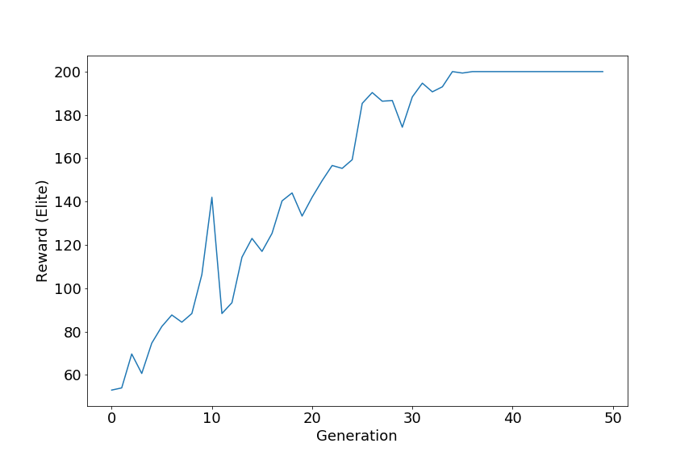
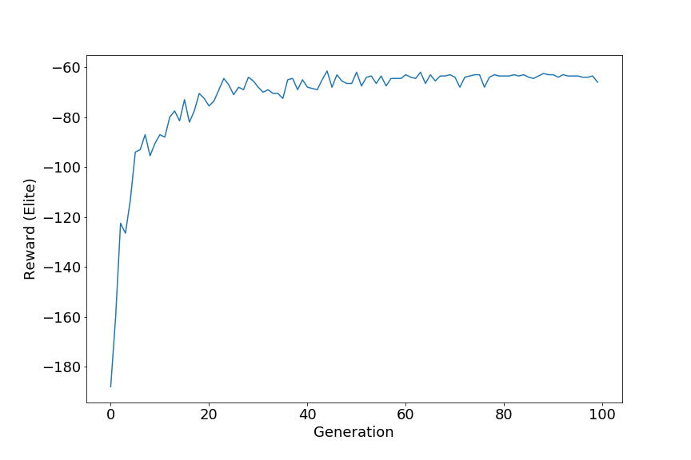

# Deep Neuroevolution : Training agents without gradients

The main aim of this project is to use Genetic Algorithms to train agents on some classic control environments from Open AI gym.

## Setup
<hr>

``` console
git line
cd folder
pip3 install -r requirements.txt
```

## Training
<hr>
For training on cartpole environment.

``` console
 python main.py --env-name cartpole --generations 50
``` 

For training on acrobot environment.

``` console
 python main.py --env-name acrobot --generations 100
``` 

## Training metrics
<hr>

| Environment | Elite Rewards |
| ----------- | ------------- |
| CartPole    |    |
| Acrobot     |   |


